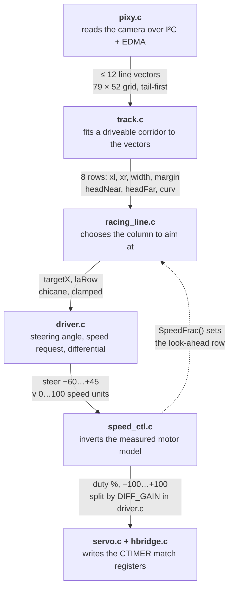

# `source/` audit

A file-by-file walkthrough of the racing firmware, how one camera frame becomes a
servo angle and two motor duties, and ten findings.

**Scope** — `race code/nxpcup_race/source/` at commit `b6b2db3`, read against
`include/`, `CMakeLists.txt` and `Debug/output.map`. Line counts from `wc -l`; the
SRAMX figures are linked sizes, not estimates.

**Configuration described** — behaviour below is what the current macros compile to:

```
SPEED_CLOSED_LOOP    1        RACE_TELEMETRY       1
STEER_PURE_PURSUIT   1        RACE_DEBUG           0
SPEED_HAVE_FEEDBACK  0        RACE_BENCH_MODE      0
```

| | |
|---|---|
| C files in `source/` | 13 |
| Lines of C | 2,813 |
| In the control chain | 1,797 (64%) |
| Track sample rows | 8 |
| SRAMX used by the log | 97.7% |
| Findings | 10 |

---

## 1. The frame pipeline

The main loop free-runs faster than the Pixy2 delivers frames. When a frame does
land, it walks these six stages in order. Everything between them is the actual data
handed on — no globals, no shared mutable state between stages.



Stages 1–6 run only when the camera returns a fresh frame. The servo slew limit, the
lost-track ladder and the acceleration shaping in stage 4 run on **every** loop
iteration, so the outputs stay smooth between frames. The dashed return is the one
closed loop in the firmware that is not a control loop: how fast the car currently is
decides how far ahead it looks.

---

## 2. File inventory

Every file below is compiled into the image by `CMakeLists.txt`. Not every file is
reachable at runtime. ● marks the camera-frame path.

### Control chain — 1,797 lines

| File | Lines | What it is | Per frame |
|---|---:|---|:---:|
| [`driver.c`](#driverc) | 682 | Steering law, speed planner, lost-track ladder, torque vectoring | ● |
| [`track.c`](#trackc) | 585 | Vectors → an eight-row corridor with a learned width model | ● |
| [`racing_line.c`](#racing_linec) | 299 | Entry/apex/exit aim point, then the hard in-bounds check | ● |
| [`speed_ctl.c`](#speed_ctlc) | 231 | Speed request in m/s → the duty that actually produces it | ● |

### Hardware and plumbing — 764 lines

| File | Lines | What it is | Per frame |
|---|---:|---|:---:|
| [`pixy.c`](#pixyc) | 361 | Pixy2 wire protocol over LPI2C + EDMA, with resync and timeouts | ● |
| [`main.c`](#mainc) | 159 | Boot order and the four-step loop | ● |
| [`telemetry.c`](#telemetryc) | 101 | 32-byte flight recorder into a reset-surviving RAM ring | ● |
| [`hbridge.c`](#hbridgec) | 94 | Per-motor duty and direction pin, fractional percent | ● |
| [`ticks.c`](#ticksc) | 49 | Microsecond clock borrowed from SysTick | ● |
| [`servo.c`](#servoc) | 49 | −100…+100 → the 1–2 ms servo pulse | ● |

### Compiled but never called — 252 lines

| File | Lines | What it is | Per frame |
|---|---:|---|:---:|
| [`semihost_hardfault.c`](#semihost_hardfaultc) | 98 | Stock NXP handler so a stray `PRINTF` cannot hang the car | ○ |
| [`simple_movement.c`](#simple_movementc) | 73 | Pre-rewrite demo loop under a `main2()` nobody calls | ○ |
| [`esc.c`](#escc) | 32 | ESC PWM helper from the brushless build, no caller | ○ |
| [`mcux_config.h`](#mcux_configh) | 18 | SDK feature-selection stub | ○ |

---

## 3. The control chain

These six files are the firmware. Four of them contain no SDK call at all, which is
deliberate — it is what lets the whole perception and planning chain compile and run
on a PC against `test/track_sim.c`.

### `main.c`

*159 lines — boot order, then one loop with four steps in it.*

Initialisation order is load-bearing. `Ticks_Init()` comes before `pixy_init()`
because the Pixy driver builds its transfer timeouts on that clock; the H-bridge is
initialised and immediately commanded to zero, and the steering to `STEER_OFFSET`,
before the camera is touched — so the car is stationary and straight while it is
still being placed on the track. A dim green LED on the camera is the only outward
sign the firmware got this far, and its return value is deliberately discarded.

In the loop, `pixy_get_vectors()` returns success only when a genuinely new frame
decoded. That boolean is passed down as `fresh` and it is what gates re-planning.
`vectors_to_segments()` widens the camera's `uint8_t` coordinates into floats, which
is the boundary where the hardware-specific type ends and the arithmetic-only chain
begins.

One thing to know when reading elsewhere: `STEER_OFFSET` is added *here*, at
`Steer(cmd.steer + STEER_OFFSET)`. Everything upstream works in a coordinate system
where zero means straight.

| | |
|---|---|
| loop rate | free-running, several times the camera rate |
| dt source | `Ticks_Us()` delta, converted to seconds |
| telemetry | one record per *camera* frame, not per loop |
| `RACE_DEBUG` | 0 — the `PRINTF` path is compiled out |

### `pixy.c`

*361 lines — the Pixy2 line-tracking protocol, over LPI2C with EDMA.*

Requests are framed `AE C1 <opcode> <len> <payload>`; replies come back
`AF C1 <type> <len> <csum16>` followed by exactly `len` bytes. The driver reads the
six-byte header first and then only the bytes that exist. The header comment is
explicit about why: the earlier version always pulled 100 bytes, which at 100 kHz
costs about 9 ms per frame and caps the control loop near 100 Hz on its own.

Three defences sit on top of that:

- If the sync word is not at offset 0, the driver drops one byte at a time — up to 16
  — hunting for `AF C1` rather than decoding whatever happened to be on the bus.
- The payload checksum is a plain byte sum, and it is verified.
- Every transfer is bounded by `XFER_TIMEOUT_US` (6 ms, against a 90 µs byte time),
  after which the EDMA transfer is aborted. A stuck bus on a moving car otherwise
  means no steering and no braking, forever.

A reply whose type is not `0x31` is almost always the camera saying "no new frame",
so it returns `kStatus_NoData` and does **not** increment the error counter. The
payload itself is a chain of `[type][len][data…]` blocks; vector blocks are six bytes
each and the endpoints are swapped so `(x0,y0)` is always the end nearest the car.

| | |
|---|---|
| grid | 79 × 52, origin top-left, larger `y` = nearer the car |
| request | `LINE_GET_ALL` + vectors only — no intersections, no barcodes |
| cap | `PIXY_MAX_VECTORS` = 12 |
| counters | `errors` and `timeouts`, both logged every frame |

### `track.c`

*585 lines — perception. Turns an unordered handful of segments into a corridor
sampled at eight fixed distances.*

**Filtering.** Any segment spanning fewer than 4 rows, or shorter than 5 px, is
dropped. That is the start-line and intersection-bar filter — a near-horizontal bar
is not a track edge, and following one drives the car off the circuit.

**The outward walk.** For each of the eight sample rows (`y` = 50, 44, 38, 32, 26,
20, 13, 6) the code takes the innermost candidate on each side of a reference column.
The reference starts at the camera centre and then follows the corridor centre
upward, row by row. That single detail is what keeps the search on *our* piece of
track when another part of the circuit is also in frame. Each row gets two passes:
the first accepts only segments that genuinely span it, and the second allows
extrapolation — bounded both by a fixed row budget (10 near, 3 far) and by 1.5× the
segment's own span, so a short stub cannot be stretched across the whole image.

**The width model.** Corridor width is modelled as a straight line in image row,
`width(y) = a·y + b`, fitted by least squares from rows that saw both black lines.
One fit covers all eight rows, so a single row that can see both edges calibrates the
rows that cannot. Learning is fast for the first 60 frames (α = 0.35) and slow
afterwards (α = 0.06). A fit claiming the track looks wider far away than near is
rejected outright — only the offset moves. A row whose measured width falls outside
0.45–1.90× the model is treated as one edge belonging to a different piece of track:
the longer, better-supported edge is kept and the other is inferred at 0.92× model
width.

**Repair and cut-off.** Single-row dropouts are interpolated from their neighbours.
If row 0 itself is missing, the two lines are extended downward from the lowest good
rows — over the bottom of the frame that is only a few centimetres of real track.
Then the model is walked from row 0 outward and truncated at the first invalid row
*or* at a centre step larger than 0.90× the local width. A jump that big means the
search latched onto a different corridor, and everything beyond it is discarded
rather than steered by.

**Outputs the driver needs.** A keep-out margin per row (0.22× width, at least 5 px,
never more than 0.45× width so the two margins cannot cross), and two headings — a
least-squares slope of the corridor centre over rows 0–3 and over rows 4–7, in pixels
sideways per row ahead. Their difference is `curv`, the rate the corner is tightening.

| | |
|---|---|
| `haveTrack` | true when at least 2 contiguous rows are valid |
| `bothEdges` | true when some row genuinely saw both lines |
| heading clamp | ±4.0 px per row |
| SDK calls | none — `math.h` only |

### `racing_line.c`

*299 lines — planning. Picks one image column to aim at, then proves the path to it
stays between the lines.*

**Confidence first.** Four or more vectors this frame means full confidence; fewer
scales down to 0.45. The reasoning is geometric: one long vector per edge is a chord
across the bend, exact at its two ends and sagging toward the inside everywhere in
between, carrying no curvature at all. Confidence then does two things — it scales
the racing-line bias down, and it pushes the aim point *outward* by up to two rows,
onto the far end of the chord where the error returns to zero. Aiming at a middle row
would aim at the sag, and the car would turn in early.

**Where the car is in the corner.** The two headings are enough to place it. With
`a = |headNear|` and `b = |headFar|`, both normalised, the phases blend continuously:

```
wEntry = bEntry · (1 − a)    straight here, corner ahead   → stay wide
wApex  = a · b               turning here and still ahead  → hug the inside
wExit  = a · (1 − b)         turning here, straight ahead  → run wide again

bias = turn · (0.85·wApex − 0.75·wEntry − 0.45·wExit)
```

Entry uses its own, more sensitive reference (0.60 rather than 1.10) so the move to
the outside starts before the car is committed. The result is smoothed at α = 0.25
per frame, so the aim point sweeps across the track rather than jumping.

**Chicanes.** Headings of opposite sign, both under 0.50, means the road bends one
way close and the other way far, with neither worth a steering input. Bias goes to
zero and the target becomes the average corridor centre over every row in view —
which is the straight line through the S.

**The hard safety rule.** This is the last thing the module does and it is not
optional. The car is assumed to sweep along `px(t) = 39 + t^1.5·(target − 39)`. Every
valid row between here and the aim row turns that into a pair of bounds on `target`;
keeping the tightest pair gives the exact window of aim points whose whole path stays
inside the black lines. It quietly overrides an over-enthusiastic apex, and it
cancels a chicane that turned out to be too tight to ignore. If the window is empty
the corridor pinches somewhere: the code splits the difference and raises `clamped`,
which downstream becomes zero steering deadband and a 10% speed cut.

One extra guard: during the entry phase the car is allowed to steer away from the
corner, but only toward an edge the camera *actually saw*. If the outside line was
inferred from the width model, the aim point is not allowed past the car's own axis —
driving toward a guess is how a car ends up on the wrong side of it.

### `driver.c`

*682 lines — control. The largest file, and the one that turns a plan into a servo
angle and two motor commands.*

**Steering.** Two inputs: how far the aim point sits beside the car, and which way the
road points right at the bumper. The default form is pure pursuit —

```
uPos = (STEER_PP_SCALE · STEER_PP_K · dx · w  +  STEER_KH · headN) / 100
```

— where `w` is the corridor width at the aim row. That is the trick worth noticing:
width in pixels is the firmware's own calibration-free measure of how far away a row
is, so multiplying by it turns a fixed gain into one that schedules itself with
look-ahead distance. The width is clamped to sane bounds first, because it multiplies
the command directly.

The deadband slides on `cornerness` — wide (0.34) when there is nothing worth turning
for, narrow (0.08) once there is, forced wide in a recognised chicane, and forced to
*zero* when the safety check had to pull the aim point back. It is a soft deadband,
so crossing it produces no step. The D term runs on the filtered pre-deadband error,
and the comment records that feeding it post-deadband was tried and destabilises real
S-bends.

**Speed.** Three cues compete and the largest wins: the far heading (weight 1.05), the
curvature (0.85) and the steering demand already computed this frame (0.90), all
normalised by 1.30. Because one of them looks at the far end of the image, a corner
still only visible in the distance already slows the car — that is the braking point,
and it lands before the corner rather than inside it. The result is then multiplied
down by how many rows are visible, by 0.92 if only one edge was genuinely seen, by
0.90 if the aim point was clamped, and by the ratio of the camera's best frame
interval to its current one. A camera that has slowed down gets a car that has slowed
down.

**Losing the track.** The ladder is measured in *metres travelled blind*, not frames,
and the comment explains exactly why: a frame is not a fixed amount of ground, and
once the speed caps below start biting, thirty frames of crawling is a few
centimetres — a frame-based stop would park the car inside every dropout it could
have driven through.

```
0.12 m  →  cap speed at SPEED_LOST (20)
0.35 m  →  cap at half that
0.75 m  →  stop
350 ms blind, or stopped for 30 lost frames  →  stop
```

The frame count survives only as the backstop for the one case distance cannot catch:
a car already at a standstill covers no more ground, so its distance budget never
expires.

**Torque vectoring.** The two wheels are split symmetrically around the commanded
speed rather than by dragging the inside one down, so the yaw moment is the same but
the average stays at what the planner asked for. If the outer wheel saturates, the
excess is taken off *both* — which preserves the difference instead of shrinking it.
See [finding 1](#1-torque-vectoring-reverses-its-yaw-direction-whenever-the-commanded-duty-is-negative):
this block behaves differently than intended when the commanded duty is negative.

| | |
|---|---|
| start sequence | 1500 ms dead, then a 600 ms ramp |
| servo slew | 900 units/s, applied every loop |
| `dt` guard | clamped to 0.1 ms … 200 ms |
| camera rate | learned: EMA α = 0.25, best-ever creeps back at 0.0008 |
| `RACE_BENCH_MODE` | 0 — when 1, steering moves and the wheels stay dead |

### `speed_ctl.c`

*231 lines — makes "speed 75" mean a speed instead of 75% of whatever the battery
happens to be at.*

The premise is stated plainly in the header: without this module the planner's number
goes to the bridge as a raw PWM duty, and what that is worth depends on the battery,
on which way the bridge decays, and on how hard the car is being dragged.
`sim/plant.py` measured all three — `K` = 2.226 (m/s)/duty, `τ` = 348 ms, and a
static map with either a 10% offset or a 30% deadband depending on decay mode.

There are two eleven-point lookup tables because the bridge is genuinely two
different machines. Driving one input from GPIO and PWMing the other gives
brake-during-off in one direction and coast-during-off in the other; brake decay is
nearly linear through the origin, coast decay has a 30% deadband and an S-shaped
middle. The car currently has coast decay going forwards, which is the worse of the
two, and that is the table in use.

Each step does three things, none of which needs a sensor:

1. **Shape the request.** The reference is rate-limited to a real acceleration
   (3 m/s² normally, 6 on a corner exit, 6 decelerating, 2.5 coasting). This is not
   politeness — the feedforward below differentiates the reference, so an unshaped
   step would ask for an unbounded duty.
2. **Invert the static map.** A request in m/s comes back as the duty that really
   produces it.
3. **Invert the 348 ms pole.** Add `τ·(dv/dt)/K`, which is the extra voltage the
   winding needs to make speed follow a ramp. This is what makes the car change speed
   *when* it is asked rather than three tenths of a second later — and it is also
   what replaced the old reverse brake pulse, since a falling reference now produces
   a proportionally negative duty on its own.

A PI term exists behind `SPEED_HAVE_FEEDBACK` (currently 0) for when a wheel-speed
sensor appears; it uses conditional integration rather than back-calculation, so
leaving a corner does not throw the accumulated value away. Meanwhile a dead-reckoning
observer keeps `vEstMs` moving through the same first-order model, which is what
`SpeedFrac()` reports back to the look-ahead — the speed the car *is*, not the one
that was asked for.

> **Read the comment on `SpeedCtl_SpeedFrac()`.** It normalises against `SPEED_MAX`,
> not `SPEED_TOP_MS`, and the comment documents the feedback trap that the obvious
> alternative creates: the look-ahead never fully extends → the steering gain stays
> high → the car steers more → the severity cue reads that as a corner → it slows
> down. A tidy loop that costs a second a lap for no reason.

---

## 4. Hardware layer

### `ticks.c`

*49 lines — a microsecond clock borrowed from SysTick, which the SDK does not use on
this board.*

SysTick runs as a plain 24-bit down-counter with no interrupt. The subtraction is
masked to 24 bits, which makes it produce the right answer across a reload without
any special case. A carry accumulator holds cycles not yet worth a whole microsecond
— at 150 MHz that is 150 cycles per µs, so discarding the remainder each call would
lose real time quickly.

The contract is in the header and it matters: `Ticks_Us()` must be called at least
once every ~111 ms (24 bits at 150 MHz) or a wrap is missed and time stands still.
The control loop runs every few milliseconds, and the Pixy busy-wait calls it
continuously, so this is never close.

### `servo.c`

*49 lines — steering angle to PWM pulse.*

−100…+100 maps onto 5–10% of CTIMER2's 20 ms frame, which is the standard 1–2 ms
servo pulse. The subtlety is the register write: the CTIMER matches on the way up, so
the value written to the match register is where the pulse *starts* — hence
`period · (100 − duty) / 100` rather than the duty directly.

Single-precision throughout, because the FPU on this part is single-precision only
and a `double` here would be software-emulated every control cycle. `TestServo()`
sweeps the servo end to end forever and never returns — it exists to find
`STEER_OFFSET` and the mechanical limits, and it is not called by the race firmware.

### `hbridge.c`

*94 lines — two motors, each a duty plus a direction pin.*

Reverse is direction-pin high **and** an inverted duty (`100 + speed`), because at
DIR = 1 the driver sees `100 − duty`. Zero is handled specially: the match value is
pushed one tick past the period so it never fires, giving a true 0% rather than a
one-tick glitch.

`HbridgeSpeedF()` writes the match registers directly instead of calling
`CTIMER_UpdatePwmDutycycle()`, and the header explains why — the SDK call only takes
whole percent, and 1% steps are coarse enough to be felt as a stutter while the speed
planner trims the throttle through a corner. `HbridgeBrake()` shorts both windings
for a real brake rather than a coast; nothing in the race firmware calls it.

### `telemetry.c`

*101 lines — a flight recorder, because the car cannot drive with a cable attached.*

Both obvious ways out are unusable here: the debug console is semihosted, so it needs
a debugger and stalls the loop for milliseconds; and the debug UART is on LPUART4,
whose pins this board's pin_mux does not route anywhere. So nothing is printed. One
32-byte fixed-point record per camera frame goes into a 3000-slot ring — about 50
seconds at 60 fps — and the whole buffer is read out afterwards over SWD with
`tools/capture.ps1` and decoded by `tools/decode_telemetry.py`.

The buffer lives in SRAMX in the linker's no-init section, so the log survives a
reset and is still there even if attaching the debugger restarts the chip. `count` is
free-running and the ring index is `count % TLM_SLOTS`, so the decoder can tell a
wrapped buffer from a partial one. See [finding 3](#3-the-telemetry-ring-occupies-977-of-sramx--room-for-71-more-records)
for the space it occupies.

---

## 5. Linked in, never entered

### `esc.c`

*32 lines — a generic 5–10% duty ESC helper.*

Same PWM idea as `servo.c`, parameterised over a CTIMER and two channels. It has no
caller in the race build — the only references are the commented-out block in
`simple_movement.c`. It also computes in `double`, which on this single-precision
part means software floating point; harmless while nothing calls it, and worth fixing
before anything does.

### `simple_movement.c`

*73 lines — the pre-rewrite demo, preserved under a second entry point.*

A four-state loop — straight, right, left, reverse — separated by busy-wait delay
loops, wrapped in `main2()`. It is the only consumer of `include/Config.h`, and only
of its `SPEED_LEFT` / `SPEED_RIGHT` constants. Compiled into the image, never called,
and it carries two unused locals that will produce warnings at any reasonable warning
level.

### `semihost_hardfault.c`

*98 lines — stock NXP code, unmodified. Keep it.*

A naked hard-fault handler that inspects the faulting instruction. If it was
`BKPT 0xAB` — the semihosting trap that a `printf` lowers to — it skips past it and
fakes a plausible return value, so an application containing semihosted calls does
not simply hang when no debugger is attached. Anything else spins in `B .`.

With `RACE_DEBUG` at 0 the race firmware makes no semihosted calls, so this handler
should never fire. It is worth keeping precisely because the failure it prevents — a
car that boots to a silent hang on the grid — is indistinguishable from a dead board.

### `mcux_config.h`

*18 lines — SDK feature-selection stub, generated.*

`CONFIG_FLASH_BASE_ADDRESS 0x0` plus two empty LVGL attribute macros; everything else
is commented out. It is listed as a source in `CMakeLists.txt`, which is how
MCUXpresso projects track headers, not a compilation unit.

---

## 6. Findings

Ten items, most severe first. One is a behavioural defect on the car; the rest are
budget limits, disabled features that still advertise themselves, and dead weight in
the image.

### 1. Torque vectoring reverses its yaw direction whenever the commanded duty is negative

`CORRECTNESS` — `source/driver.c:626–652`

The differential is applied as `outer = base·(1+diff)`, `inner = base·(1−diff)`, and
`outer` is then assigned to whichever wheel is on the outside of the turn. With
`base > 0` that gives the outside wheel more drive and rotates the car into the
corner, exactly as intended. With `base < 0` — which `SpeedCtl_Step()` produces
routinely under braking, since `allowBrake` permits duties down to −100 — the outside
wheel gets *more reverse* than the inside one, and the yaw moment flips sign.

```
base = +50, diff = 0.20   outer(L) = +60, inner(R) = +40   →  yaws right  ✓
base = −50, diff = 0.20   outer(L) = −60, inner(R) = −40   →  yaws left   ✗
```

The reachable case is corner entry: the far-heading cue drops the target, the
feedforward term (`τ·dv/dt/K·100` ≈ −94 at the 6 m/s² decel limit) drives duty
negative, and the car is steering at the same moment. The differential then works
against the turn-in it was added to help. Gating `diff` on `base > 0`, or negating it
when `base` is negative, resolves it — which of the two is a handling question worth
one A/B run.

The saturation guard immediately below has the same one-sided assumption:
`if (outer > 100.0f)` redistributes the excess to preserve the wheel difference, but
there is no matching `< −100` branch, so under heavy braking the final clamp on
`cmd->left` / `cmd->right` silently shrinks the difference instead.

### 2. The whole brake-pulse block is compiled out, and nothing says so at the config

`DEAD CONFIG` — `source/driver.c:518`, `include/race_config.h:582–585`

The guard is `#if BRAKE_ENABLE && !SPEED_CLOSED_LOOP`, and both macros are 1. The
block never compiles, so `s_brakeMs` is never set, the reverse-pulse branch never
runs, and `cmd->braking` is permanently false — which also means `TLM_F_BRAKING` never
appears in a capture. This is intentional and the comment in the closed-loop path
explains the reasoning well. The problem is that `race_config.h` still presents
`BRAKE_ENABLE 1`, `BRAKE_TRIGGER`, `BRAKE_REVERSE_MAX` and `BRAKE_MAX_MS` as live
tuning knobs. Anyone tuning braking will change them and measure nothing.

### 3. The telemetry ring occupies 97.7% of SRAMX — room for 71 more records

`BUDGET` — `source/telemetry.c:6`, `include/telemetry.h:26`

The map file places `g_tlm` at `0x04000000` with a size of `0x1771C` (96,028 bytes)
in a region of `0x18000` (98,304). That is 2,276 bytes spare, or 71 further 32-byte
slots. Raising `TLM_SLOTS` from 3000 to even 3072 fails the link, and any future use
of SRAMX for `.data` or `.bss` collides with the log. Worth a comment at the
`TLM_SLOTS` definition stating the ceiling, since the current value looks like a
round number rather than a hard limit.

### 4. The farthest sample row sits ~15% above the width gate that rejects it

`TUNING` — `include/race_config.h:102, 150`

`TRK_MIN_ROW_WIDTH_PX` is `PIXY_FOCAL_PX / TRK_MAX_LOOKAHEAD_WIDTHS` = 68 / 3 =
22.67 px, and any row narrower than that is discarded as too far away to believe. The
seeded width at the top row (`y` = 6) is `TRK_WIDTH_FAR_PX` = 26.0 px. So row 7
clears the gate by 3.3 px.

That is a real coupling, because it is self-reinforcing in the wrong direction: a
slightly narrow learned model drops the top rows → `nValid` falls → `see_factor()`
cuts speed → and the top rows are exactly the ones that give `headFar` its lever arm.
Either the row table should stop short of `y` = 6, or `TRK_MAX_LOOKAHEAD_WIDTHS`
should carry a note that it is bounded below by the far-width seed.

### 5. The curvature feedforward is off, and `cornerness_of()` is evaluated twice per frame

`DISABLED FEATURE` — `source/driver.c:228–263`, `include/race_config.h:400`

`STEER_KFF` is `0.0f`, so the term contributes nothing — but it carries roughly 35
lines of explanation across two files, including a careful argument about why a
P-only car cannot hold an apex and why `curv` must be clamped in an S-bend. A reader
will reasonably assume it is active. Either set it and re-tune, or move the reasoning
into a note that says plainly it was measured turning in early and switched off.

Separately, `plan_steering()` calls `cornerness_of()` once for the deadband and again
inside the feedforward branch. It is cheap, but the two calls are guaranteed to
return the same value on the same frame.

### 6. The Pixy line mode is never set — the camera runs on whatever it booted with

`OMISSION` — `source/main.c:105–110`

`pixy_set_line_mode()` is implemented and exported but never called, so the line
tracker keeps whatever mode is stored in the camera's own configuration. That is fine
as long as every camera on the team has been configured identically in PixyMon and
nobody reflashes one. An explicit call at startup — even just to the current defaults
— makes the firmware self-describing and removes a source of "it works on the other
car".

### 7. 105 lines of pre-rewrite code are compiled into the flashed image

`DEAD CODE` — `source/simple_movement.c`, `source/esc.c`

`simple_movement.c`'s `main2()` and all of `esc.c` are unreachable — `main2` has no
caller and every `Esc*` reference is inside a comment. They cost flash, they produce
unused-variable warnings, and `esc.c` pulls in soft-float `double` routines. If they
are kept as bench tools, guarding both with a `#if RACE_BENCH_TOOLS` and dropping
them from `CMakeLists.txt` by default states the intent; if not, delete them — git
has them.

### 8. `Config.h` is a second, stale copy of the steering constants

`HYGIENE` — `include/Config.h`

It defines `STEERING_OFFSET −13`, `STEERING_LIMIT_RIGHT 45` and
`STEERING_LIMIT_LEFT −60` — the same three numbers `race_config.h` defines as
`STEER_OFFSET`, `STEER_LIMIT_RIGHT` and `STEER_LIMIT_LEFT`. Only `SPEED_LEFT` and
`SPEED_RIGHT` are actually read, and only by dead code. Two files holding the same
physical calibration is one file too many: the next time the servo horn is adjusted,
one of them will be updated and the other will not.

### 9. Two lost-track constants survive the rewrite that replaced them

`HYGIENE` — `include/race_config.h:618–620`

`LOST_COAST_FRAMES` and `LOST_SLOW_FRAMES` are unreferenced — the ladder now runs on
`LOST_COAST_M` / `LOST_SLOW_M`. Only `LOST_STOP_FRAMES` is still read, as the
stopped-car backstop. Sitting next to the distance constants under the same heading,
the frame-based pair reads as live.

### 10. Four exported functions have no caller

`UNUSED API` — `track.c:78`, `speed_ctl.c:106`, `hbridge.c:86`, `servo.c:31`

`Track_LearnedWidth()` (documented for diagnostics), `SpeedCtl_Measure()` (waiting on
a wheel-speed sensor), `HbridgeBrake()` and `TestServo()`. All four are deliberate
and worth keeping — this is a note so nobody deletes `SpeedCtl_Measure()` as dead
weight and then has to reconstruct the feedback path when an encoder arrives.
`Track_LearnedWidth()` in particular would be a useful addition to the telemetry
record, where the learned width model is currently invisible.
